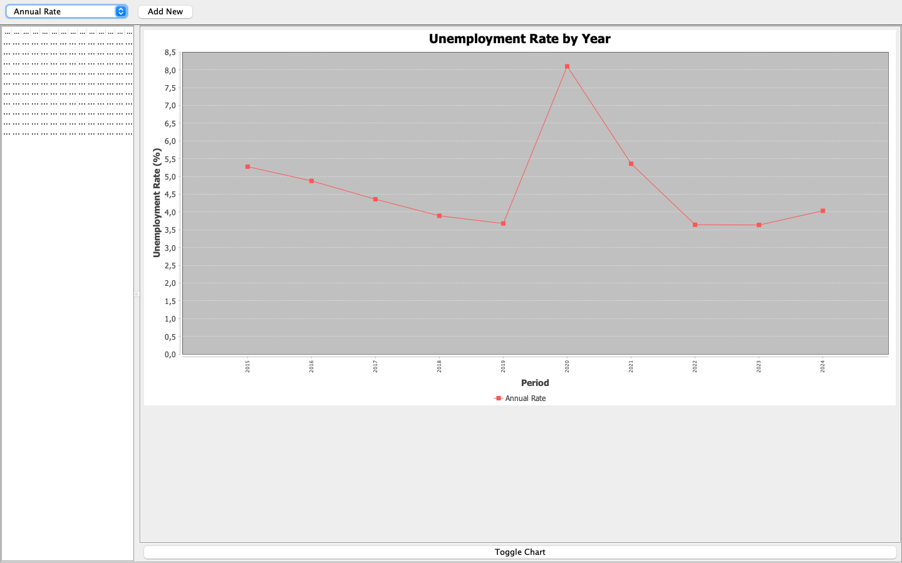
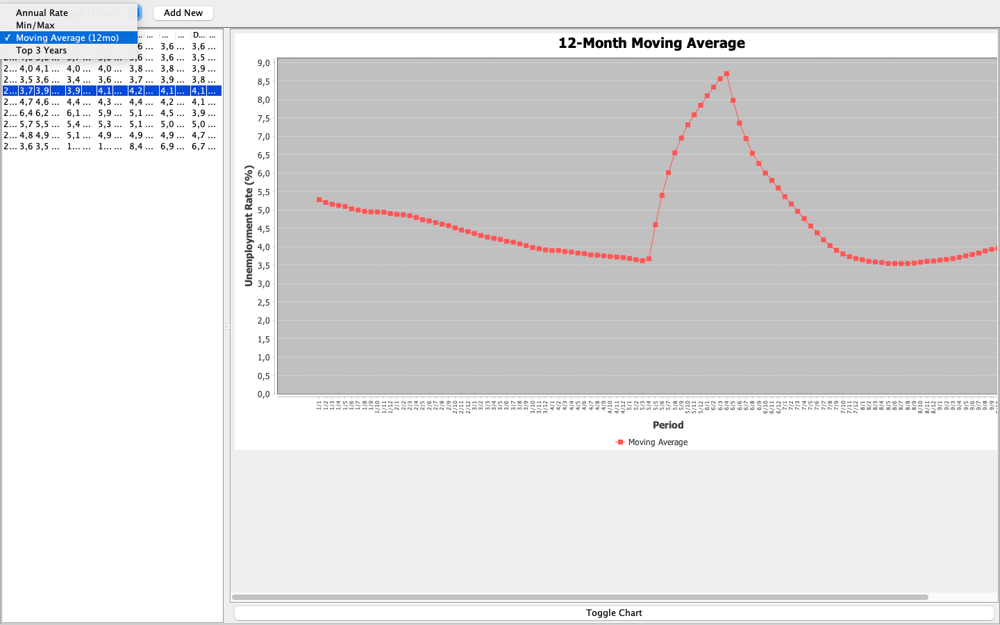
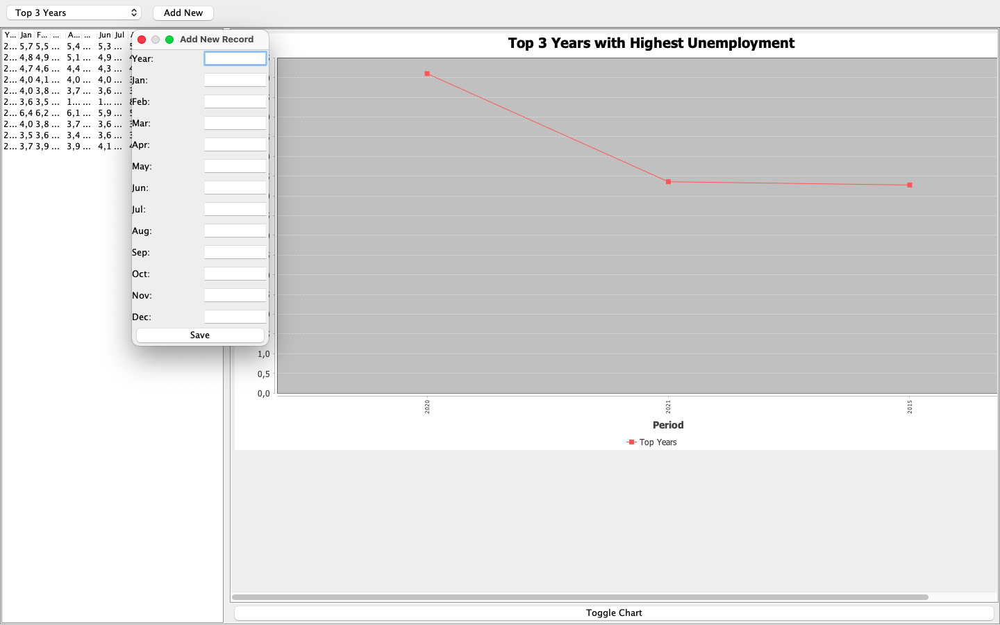

# UnempX


_UnempX_ is a Java application for **analyzing US unemployment rates** from **2015 to 2024**.  
The data comes from the **Bureau of Labor Statistics Public Data Query (PDQ) System** ([source](https://data.bls.gov/pdq/SurveyOutputServlet)).

The application allows users to **import, manage, analyze, and visualize unemployment data** to identify trends and patterns.

---

## 🚀 Technologies
- **Language:** Java
- **Build Tool:** Maven
- **GUI:** Swing
- **Data Format:** CSV

---

## 🖼️ Screenshots

**App Overview**  


**Select Data Window**  


**Add New Data Window**  


---

## 📦 Installation & Running

### Using Maven
From the root of the project (where `pom.xml` is located):

```bash
# Build the project
mvn clean install

# Run the application
mvn -Dexec.mainClass="com.myorg.unempx.Main" exec:java
